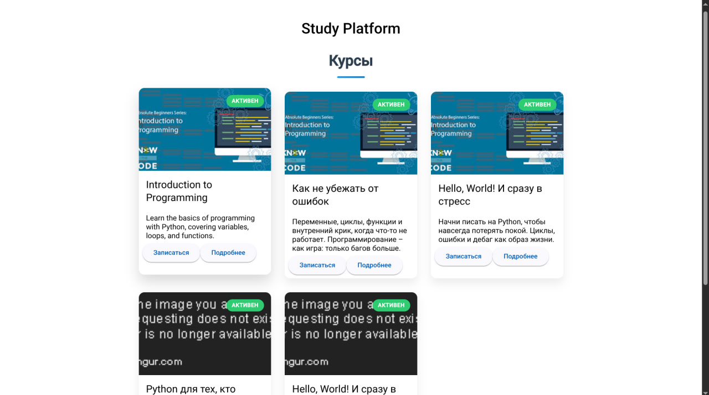

# Study Platform API Documentation

This document provides comprehensive information about the Study Platform API endpoints.

## Getting Started

### Backend Setup

To run the backend services:

```bash
# From the project root directory
docker-compose up --build
```

### Frontend Setup

To run the frontend application:

```bash
# Install dependencies
npm install

# Start the development server
ng serve
```

**Note:** The frontend currently only implements authentication and user retrieval functionality.



## API Documentation

The API is accessible through Swagger UI at `/swagger/index.html` once the server is running.

## API Endpoints

### Health Check

* **GET** `/health`
  * Description: Simple health check endpoint
  * Response: `{"status": "ok"}`
  * Authentication: None required

### Authentication

* **POST** `/api/auth/login`
  * Description: Authenticate a user and return a JWT token
  * Request Body: User credentials (username/email and password)
  * Response: JWT token and user details
  * Authentication: None required

* **POST** `/api/auth/register`
  * Description: Register a new user
  * Request Body: User registration details
  * Response: Created user details
  * Authentication: None required

### Users

* **GET** `/api/users/:username`
  * Description: Get user details by username
  * Response: User details
  * Authentication: JWT token required

* **DELETE** `/api/users/:id`
  * Description: Delete a user by ID
  * Response: Success/failure message
  * Authentication: JWT token required
  * Authorization: Admin role required

* **GET** `/api/users/`
  * Description: Search or list users
  * Query Parameters: Search criteria
  * Response: List of users matching criteria
  * Authentication: JWT token required

### Courses

* **POST** `/api/courses/`
  * Description: Create a new course
  * Request Body: Course details
  * Response: Created course details
  * Authentication: JWT token required
  * Authorization: Admin or Teacher role required

* **GET** `/api/courses/:id`
  * Description: Get course details by ID
  * Response: Course details
  * Authentication: JWT token required

* **GET** `/api/courses/`
  * Description: Get all available courses
  * Response: List of courses
  * Authentication: JWT token required

* **DELETE** `/api/courses/:id`
  * Description: Delete a course by ID
  * Response: Success/failure message
  * Authentication: JWT token required
  * Authorization: Admin or Teacher role required

### Course Enrollment

* **POST** `/api/courses/:id/enroll`
  * Description: Enroll the current user in a course
  * Response: Enrollment details
  * Authentication: JWT token required

* **GET** `/api/enrollment/:id`
  * Description: Get enrollment details by ID
  * Response: Enrollment details
  * Authentication: JWT token required

* **GET** `/api/enrollment/`
  * Description: Get all enrollments for the current user
  * Response: List of enrollments
  * Authentication: JWT token required

* **DELETE** `/api/enrollment/:id`
  * Description: Delete an enrollment by ID
  * Response: Success/failure message
  * Authentication: JWT token required
  * Authorization: Admin role required

### Lessons

* **POST** `/api/courses/:id/lessons`
  * Description: Create a new lesson for a course
  * Request Body: Lesson details
  * Response: Created lesson details
  * Authentication: JWT token required
  * Authorization: Admin or Teacher role required

* **GET** `/api/courses/:id/lessons`
  * Description: Get all lessons for a course
  * Response: List of lessons
  * Authentication: JWT token required
  * Prerequisite: User must be enrolled in the course

### Lesson Progress

* **POST** `/api/courses/:id/lessons/:lesson_id/complete`
  * Description: Mark a lesson as completed
  * Response: Updated lesson progress
  * Authentication: JWT token required
  * Prerequisite: User must be enrolled in the course

* **GET** `/api/courses/:id/progress`
  * Description: Get the user's progress for a course
  * Response: Course progress details
  * Authentication: JWT token required
  * Prerequisite: User must be enrolled in the course

### Certificates

* **GET** `/api/certificates/course/:course_id`
  * Description: Generate or retrieve a certificate for completed course
  * Response: Certificate details/download
  * Authentication: JWT token required
  * Prerequisite: User must have completed the course

## Authentication

The API uses JWT (JSON Web Token) for authentication. To access protected endpoints, include the JWT token in the Authorization header:

```
Authorization: Bearer <your-jwt-token>
```

## CORS Configuration

The API allows cross-origin requests from:
- `http://localhost:4200` (Frontend application)

Allowed methods:
- GET, POST, PUT, DELETE, OPTIONS

Allowed headers:
- Origin, Content-Type, Authorization

## Error Handling

The API returns appropriate HTTP status codes:
- 200: Success
- 400: Bad Request
- 401: Unauthorized
- 403: Forbidden
- 404: Not Found
- 500: Internal Server Error

Each error response includes a descriptive message to help diagnose the issue.